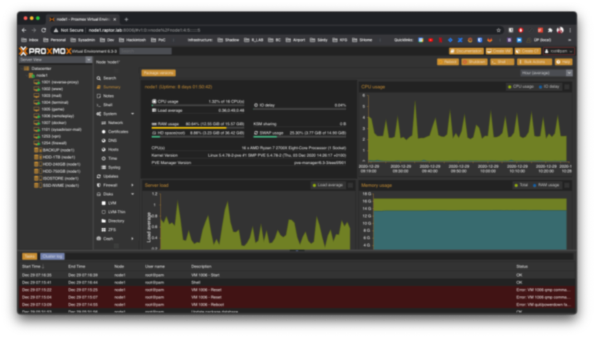

# ProxmoxVEDark - Dark Proxmox Theme

This repo is based of [Weilbyte's work](https://github.com/Weilbyte/PVEDiscordDark)!

---



A dark theme for the Proxmox Web UI, because eyes need not to be fried.
It's kinda a fork of PVEDiscordDark but I replaced the colors because I hate purple so much.

**Disclaimer:** I'm far from being a CSS expert or a web developer. I was unable to replace all the purple stuff and some borders and missing. So there are issues. But I was in a hurry, and the current look is usuable enough (for me). I published the repo because I think there are other people who don't like light, neither purple themes.

## Installation

The installation is very simple thanks to the utility. Run the following commands on the PVE node serving the Web UI and follow the on-screen instructions!

```bash
wget https://raw.githubusercontent.com/msbence/ProxmoxVEDark/master/ProxmoxVEDark.py
python3 ProxmoxVEDark.py
```

## Uninstallation

To uninstall the theme, simply run the utility, and if it detects the theme installed it will give you an option to remove it.
